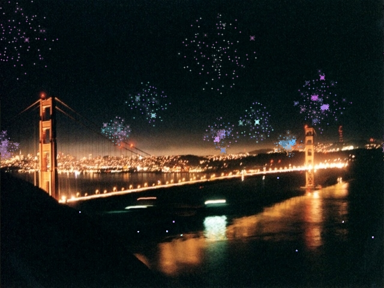



## COOL FIREWORKS SCREENSAVER\!\!\!

### Description

This is the screensaver with the COOLEST GRAPHICS YOU'VE EVER SEEN! You've got to see it in motion before it really works, as up to 20 fireworks simultanouesly shoot upwards at different angles and speeds, explode into different bursts of color, lighting up the surroundings slightly, and then sparkle and slowly disperse and fade away with really cool blending/blurring effects with the background!!! You have never seen anything like this. REQUIRES DIRECTX7 or higher, I have DirectX 8 and it worked fine but it should also work on DX7. You also need to have a monitor capable of 24 bit color. I would appreciate lots of VOTES AND/OR FEEDBACK because I worked very hard on this one! Visit my website at www.VBgames.co.uk!
 
### More Info
 

             |
---                |---
**Submitted On**   |2000-11-19 22:35:32
**By**             |[Simon Price](https://github.com/Planet-Source-Code/PSCIndex/blob/master/ByAuthor/simon-price.md)
**Level**          |Intermediate
**User Rating**    |4.9 (54 globes from 11 users)
**Compatibility**  |VB 6\.0
**Category**       |[DirectX](https://github.com/Planet-Source-Code/PSCIndex/blob/master/ByCategory/directx__1-44.md)
**World**          |[Visual Basic](https://github.com/Planet-Source-Code/PSCIndex/blob/master/ByWorld/visual-basic.md)
**Archive File**   |[CODE\_UPLOAD1187811202000\.zip](https://github.com/Planet-Source-Code/simon-price-cool-fireworks-screensaver__1-12974/archive/master.zip)

